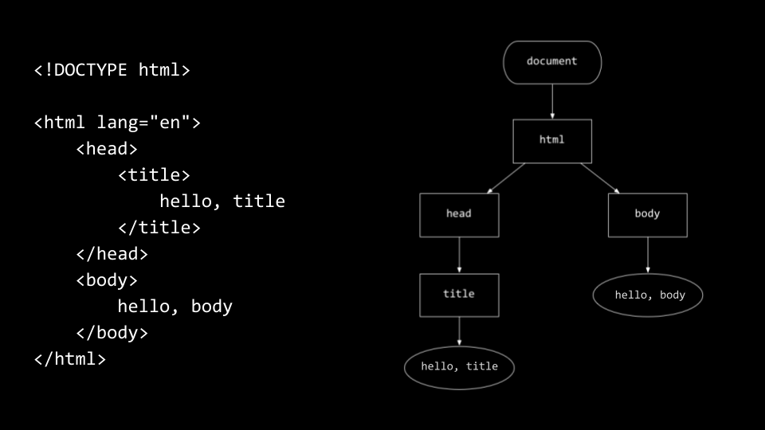

# CS50 Week 8 – HTML, CSS, JavaScript

Week 8 focused on the fundamentals of the web stack: how the internet works, how data moves, and how to build actual web pages with HTML, style them with CSS, and add interactivity with JavaScript.

---

## Core Topics

- **Internet Architecture**
  - ARPANET, routers, TCP/IP, packets
  - DNS for resolving domains to IP addresses
  - DHCP for assigning IPs and gateways
  - HTTP vs HTTPS, request and response headers, status codes

- **HTML**
  - Basic document structure: `<!DOCTYPE html>`, `<html>`, `<head>`, `<body>`
  - Tag hierarchy and the DOM tree
  - Headings, lists, images, video, links, forms
  - Importance of semantic tags (`<header>`, `<main>`, `<footer>`)

- **CSS**
  - Inline styles, classes, external stylesheets
  - Class selectors for reusability
  - Bootstrap framework for responsive design

- **JavaScript**
  - Event listeners and DOM manipulation
  - Template literals for cleaner code
  - Programmatic style changes and interactivity
  - Example: auto-complete search and button-controlled styling

---

## Example

Minimal HTML page with DOM structure:

```html
<!DOCTYPE html>
<html lang="en">
  <head>
    <title>hello, title</title>
  </head>
  <body>
    hello, body
  </body>
</html>
```

DOM hierarchy:



---

## Key Takeaways

- HTML defines structure, CSS handles design, JavaScript adds interactivity.
- HTTP is the transport layer, everything else is built on top.
- Bootstrap saves time by standardizing design.
- JavaScript turns static pages into applications by manipulating the DOM.

---

## Resources

- [CS50 Problem Sets](https://cs50.harvard.edu/x/2025/psets/)
- [CS50 Manual](https://manual.cs50.io/)
- [MDN JavaScript Docs](https://developer.mozilla.org/en-US/docs/Web/JavaScript)
- [Bootstrap Docs](https://getbootstrap.com/docs/)

---

## Status

Completed: Week 8 – HTML, CSS, JavaScript
Next: Week 9 – Flask and dynamic web apps.
